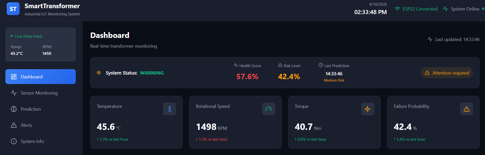
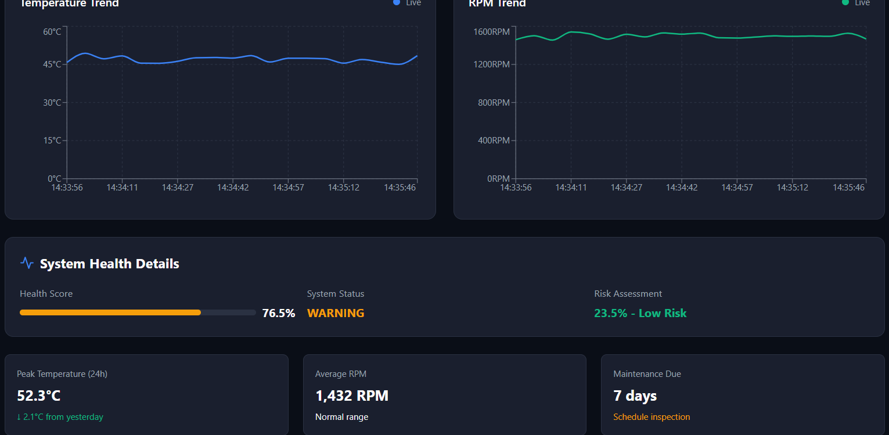
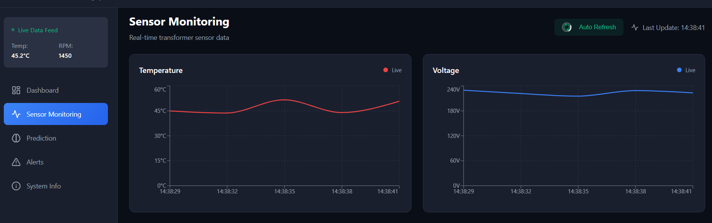
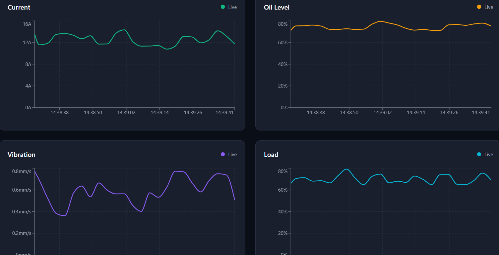
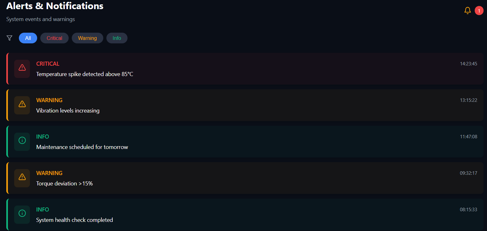
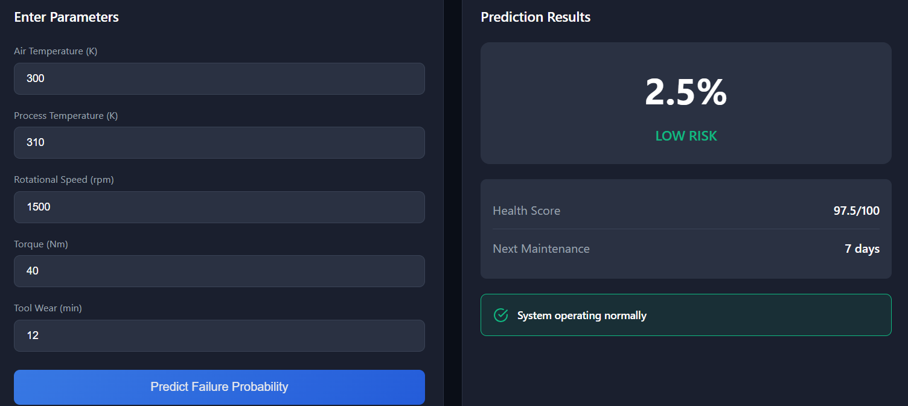
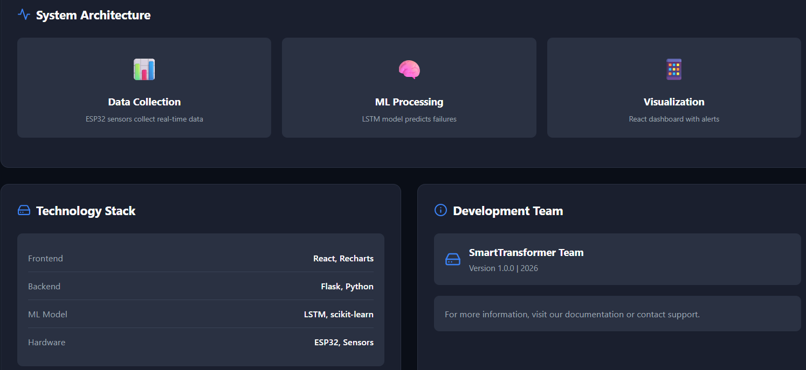
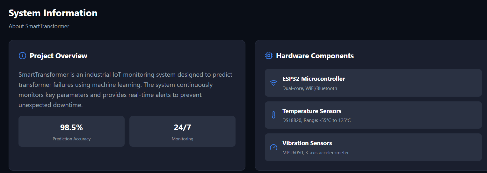

# 🚀 SMART TRANSFORMER HEALTH MONITORING SYSTEM

---

## 📌 OVERVIEW

The **Smart Transformer Health Monitoring System** is an **Industrial IoT + Machine Learning-based predictive maintenance project** designed to monitor transformer health conditions in real-time and predict failures before they occur.

It integrates:

- Artificial Intelligence (AI)  
- Machine Learning (ML)  
- IoT Concepts  
- Full Stack Web Development  

This system improves **power system reliability, safety, and predictive maintenance efficiency**.

---

## 🎯 OBJECTIVES

- Design an intelligent transformer monitoring system using IoT concepts  
- Analyze transformer operational parameters  
- Predict transformer failure using Machine Learning models  
- Calculate health score and risk level  
- Build an interactive web dashboard  
- Simulate real-time sensor data  
- Support predictive maintenance systems  

---

## ⚙️ FEATURES

- Real-time transformer monitoring  
- ML-based failure prediction  
- Health score calculation  
- Risk level detection (Low / Medium / High)  
- Interactive dashboard with graphs  
- Alert system for abnormal conditions  
- Simulated IoT sensor data  

---

## 🏗️ SYSTEM ARCHITECTURE

### 🔹 Data Layer
- Transformer dataset  
- Simulated sensor data  
- Real-time inputs  

### 🔹 Machine Learning Layer
- Data preprocessing  
- Feature engineering  
- Model training (Random Forest / XGBoost)  
- Failure prediction  

### 🔹 Backend Layer
- Flask REST API  
- ML model integration  
- Data processing services  

### 🔹 Frontend Layer
- React dashboard  
- Graph visualization  
- Alerts system  

---

## 📊 INPUT PARAMETERS

- Temperature  
- Voltage  
- Current  
- Torque  
- Rotational Speed (RPM)  
- Oil Level  

---

## 🤖 MACHINE LEARNING MODEL

### Algorithms Used:
- Random Forest  
- XGBoost  

### Output:
- Health Status  
- Failure Probability  
- Risk Level  

---

## 🔄 SYSTEM WORKFLOW

1. Collect transformer data  
2. Send data to Flask API  
3. Backend processes data  
4. ML model predicts output  
5. Results sent to frontend  
6. Dashboard displays visualization  

---

## 🛠️ TECH STACK

### Frontend:
- React.js  
- Tailwind CSS  
- Chart.js / Recharts  

### Backend:
- Flask  
- Python  

### ML:
- Scikit-learn  
- Pandas  
- NumPy  
- XGBoost  

### Future Hardware:
- ESP32  
- IoT Sensors  

---

## 📸 SCREENSHOTS

### Dashboard

### Monitoring

### Alerts

---

## 📈 RESULTS

- Accurate transformer failure prediction  
- Early risk detection  
- Improved maintenance planning  
- Real-time monitoring dashboard  

---

## 🚀 FUTURE WORK

- IoT hardware integration (ESP32)  
- Cloud deployment (AWS / Azure IoT)  
- Deep Learning models  
- SMS / Email alerts  
- Edge AI deployment  

---

## 👩‍💻 AUTHOR

**Laxmipriya Rout**  
AI / ML Enthusiast  

GitHub: https://github.com/laxmipriya-345  
LinkedIn: https://linkedin.com/in/laxmipriya-rout-6b9b6a292  

---

## 📜 LICENSE

This project is licensed under the MIT License.

---

## ⭐ SUPPORT

If you like this project:
⭐ Star the repository  
🔁 Share it  
💡 Contribute improvements  
